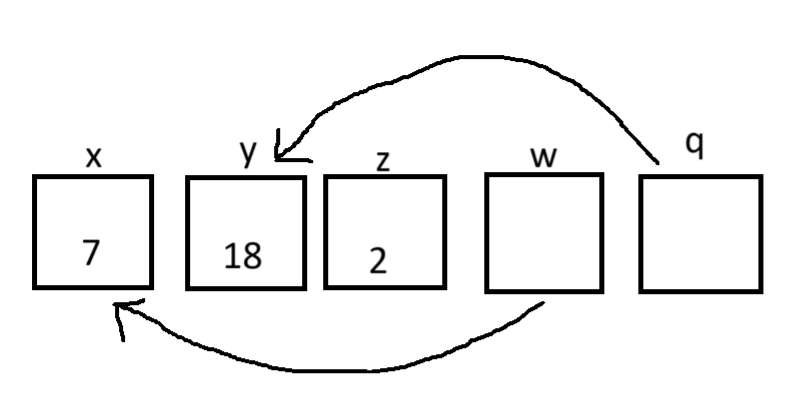
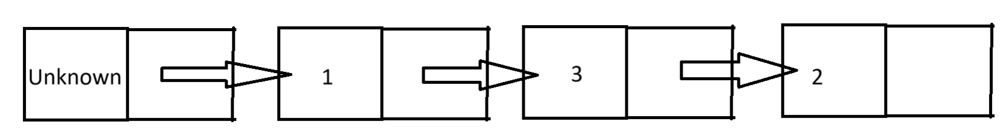
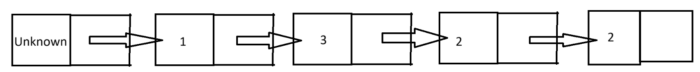

# Aflevering 6
***By Daniel L and Mikkel R***

## Exercise 1

Thus
$$x=7$$
$$y=18$$
$$z=2$$


## Exercise 2
```C
#include "max.h"
#include <assert.h>
#include <stdio.h>

int max(int *numbers, int size) {
  //pre-condition
  assert(numbers && size > 0);
  
  // Sets the record to be the first element in the array
  int largestFound = numbers[0];
  for (int i = 0; i < size; i++) {
    if (numbers[i] > largestFound) {
      // If an element is found that is bigger than the largest found
      // This is the new record
      largestFound = numbers[i];
    }
  }
  return largestFound;
}

#ifndef TEST

int main() {

	return 0;
}
#endif
```

## Exercise 3

**a)**
First list:

Second list:


**b)**
```C
int size(node *l) {
  assert(l);
  int counter = 0;
  node* p = l;
  while(p->next != NULL){
    p = p->next;
    counter++;
  }
	return counter;
}
```

**c)**
Look at the following line of code from the printout function:
```C
while (p != NULL) {
    printf("%d, ", p->data);
}
```
Here we have an infinite loop because p will never change. Which means it will always not be NULL. Therefore the post-condition is not fullfilled.

**d)**
```C
void printout(node *l) {
  // pre:  head points to the first, empty element.
  //       The last element's next is NULL
  // post: The values of the list are printed out
  node* p = l->next;
  //The While-loop traverses the linked list and prints every element
  while (p != NULL) {
    printf("%d, ", p->data);
    p = p->next;
  }
  printf("\n");
}
```

**e)**
```C
int largest(node *head) {
  // pre:  head poinst to the first, empty element.
  // 	     The last element's next is NULL.
  // post: Returns the largest value of the list

  // Sets the record to be the first node to be the record
  int record = head->data;
  while(head != NULL) {
    if (head->data > record) {
      // Checks if the next nodes data is larger and if it is, it sets this as the new record
      record = head->data;
    }
    // Goes to the next node
    head = head->next;
  }
  return record;
}
```

## Exercise 4 (Challenge)
```C
#include <assert.h>
#include <stdbool.h>
#include <stdio.h>
#include <stdlib.h>
// A struct that contains a dynamic array of integers
// The struct owns the array and is responsible for freeing it
typedef struct {
  int *buffer;
  size_t size;
  size_t capacity;
} array_of_int;
array_of_int read_int_array_from_file(const char *filename) {
  assert(filename != NULL);
  FILE *file = fopen(filename, "r");
  if (file == NULL) {
    fprintf(stderr, "Could not open file '%s'\n", filename);
    exit(1);
  }
  const size_t initial_capacity = 256;
  size_t capacity = initial_capacity;
  int *array = malloc(capacity * sizeof(int)); // Start with a smaller initial capacity
  size_t size = 0;
  if (array == NULL) {
    fprintf(stderr, "Memory allocation failed\n");
    exit(1);
  }
  while (true) {
    int value = 0;
    int status = fscanf(file, "%d", &value);
    if (status == EOF) {
      break;
    }
    if (size >= capacity) {
      // Double the capacity and reallocate memory
      capacity *= 2;
      int *new_array = realloc(array, capacity * sizeof(int));
      if (new_array == NULL) {
        fprintf(stderr, "Memory reallocation failed\n");
        free(array);
        exit(1);
      }
      array = new_array;
    }
    array[size] = value; // Insert the value into the array
    size++;
  }
  fclose(file);
  return (array_of_int){.buffer = array, .size = size, .capacity = capacity};
}
typedef unsigned long MemoryType;

typedef struct Computer
{                                
  MemoryType* RAM;
  MemoryType registers[10];
  size_t currentInstruction;
  bool running;
  int d;
  int n;
} Computer;

typedef void (*ExecuteFunction)(Computer*);

//200
void Set(Computer* computer){
  computer->registers[computer->d] = computer->n;
  computer->registers[computer->d] = computer->registers[computer->d]%1000;
  //printf("Set\n");
}

//300
void Add(Computer* computer){
  computer->registers[computer->d] += computer->n; 
  computer->registers[computer->d] = computer->registers[computer->d]%1000;
  //printf("Add\n");
}

//400
void Multiply(Computer* computer){
  computer->registers[computer->d] *= computer->n;
  computer->registers[computer->d] = computer->registers[computer->d]%1000;
  //printf("Multiply\n");
}

//500
void Set2(Computer* computer){
  computer->registers[computer->d] = computer->registers[computer->n];
  computer->registers[computer->d] = computer->registers[computer->d]%1000;
  //printf("Set2\n");
}

//600
void Add2(Computer* computer){
  computer->registers[computer->d] += computer->registers[computer->n];
  computer->registers[computer->d] = computer->registers[computer->d]%1000;
  //printf("Add2\n");
}

//700
void Multiply2(Computer* computer){
  computer->registers[computer->d] *= computer->registers[computer->n];
  computer->registers[computer->d] = computer->registers[computer->d]%1000;
  //printf("Multiply2\n");
}

//800
void Set3(Computer* computer){
  computer->registers[computer->d] = computer->RAM[computer->registers[computer->n]];
  computer->registers[computer->d] = computer->registers[computer->d]%1000;
  //printf("Set3\n");
}

//900
void Set4(Computer* computer){
  computer->RAM[computer->registers[computer->n]] = computer->registers[computer->d];
  computer->RAM[computer->registers[computer->n]] = computer->RAM[computer->registers[computer->n]]%1000;
  //printf("Set4\n");
}

//000
void Goto(Computer* computer){
  if(computer->registers[computer->n] != 0 ){
    computer->currentInstruction = computer->registers[computer->d];
  }
  //printf("GoTo\n");
}

//100
void Halt(Computer* computer){
  computer->running = false;
  //printf("Halt\n");
}

ExecuteFunction Decode(MemoryType instruction,Computer* computer){
  //value 0-9
  int instructionType = instruction/100;

  computer->d = (instruction%100)/10;
  computer->n = instruction%10;

  switch (instructionType)
  {
  case 0:
    return &Goto;
    break;

  case 1:
    return &Halt;
    break;

  case 2:
    return &Set;
    break;

  case 3:
    return &Add;
    break;
  
  case 4:
    return &Multiply;
    break;
  
  case 5:
    return &Set2;
    break;

  case 6:
    return &Add2;
    break;
  
  case 7:
    return &Multiply2;
    break;
  
  case 8:
    return &Set3;
    break;
  
  case 9:
    return &Set4;
    break;
  
  default:
    assert(0);
    break;
  }
}

void Run(Computer* computer){
  computer->running = true;
  computer->currentInstruction = 0;

  int instructionsRun = 0;

  while(computer->running){
    //Fetch
    MemoryType instruction = computer->RAM[computer->currentInstruction];
    //Decode
    ExecuteFunction decode = Decode(instruction,computer);
    //Execute
    instructionsRun++;
    computer->currentInstruction++;
    decode(computer);

  }
  
  printf("%d\n",instructionsRun);
}

void main( int argc, char** argv) {
    
    MemoryType RAM[1000] = {0};

    // if (argc != 2) {
    //     fprintf(stderr, "Usage: %s <filename>\n", argv[0]);
    //     exit(1);
    // }
    array_of_int array = read_int_array_from_file("codes.txt");
    assert(array.size <= 1000);
    for (size_t i = 0; i < array.size; i++) {
        RAM[i] = array.buffer[i];
    }
    Computer computer;
    computer.RAM = RAM;
    
    Run(&computer);

    free(array.buffer);
    return 0;
}
```
